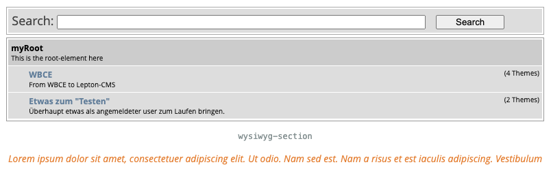
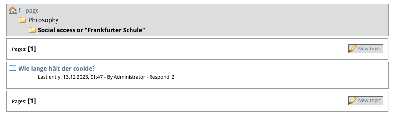

## WBCE Forum
This module integrates a simple forum in your [WBCE][2] website.

###
- license	http://www.gnu.org/licenses/gpl.html
- platform	[WBCE][2] >= 1.5.1
- version	0.6.8

### Authors
Julian Schuh, Bernd Michna, "Herr Rilke", Dietrich Roland Pehlke (last) 

#### Brief changelog
Full list here [GitHub] [3]  
Details on [GitHub] [3]

##### 0.6.8
- Add preinit and additional class.
- Remove some typos and wrong values in some (headers-)comments.
- Module_home is now WBCE repository (broken link in WB[-org]).
- Frontend-template css support.
- Backend-theme css support.
- Set some db-fields up to 180 chars (was limited to 30).
- Use twig-instance (reference) from WBCE.


## Installation:
Install the zipfile as a normal module through the WB backend.

#### REQUIREMENTS:
Ensure that the template calls the frontend.css or use:
```code
<?php
// this allows to include the optional module files (frontend.css, frontend.js) into the head section
if(function_exists('register_frontend_modfiles')) {
  register_frontend_modfiles('css');
  register_frontend_modfiles('jquery');
  register_frontend_modfiles('js');
} ?>
```
##### Frontend-template css support
Instead of overwriting/changing the frontend.css of the module itself the user  
can add his own-css inside the frontend-template:
```code
Path: ~/wbce/templates/<the_current_frontend-template>/frontend/forum/frontend.css
```
Keep in mind that the use img inside the css hav rellative paths, so  
it is a good idea to place the (own) used img inside a subfolder "images" there also.
Or just copy them from the module.

Attention to the call of JavaScript (filename.js) more than once in the template which would make problems. Perhaps you need to comment the last line out with "//".





##### Using the module:
Add a new page with the type «forum».  
Check the page administration if a usergroup should get permissions to modify/delete the page.
Click on the settings button. The settings are self explanatory. Use existent email addresses, if you want a message about new post in the forum! Change it to your wishes, save it or cancel the settings page.

Create a new forum and write a title (e.g. «motor cars»).  
Describe the forum (e.g. «motor cars since 2000»).  
Display order is empty for the first forum. When you have more forums you can order the forums here with a number.  
Parent forum is also empty "-" for the first forum.  
Permission for the forum user in the frontend. Select Both, Registered or Anonymous users who can read and/or write posts.  
Save the first forum, cancel it or clean all listings with Reset.  

After saving create a new (sub-) forum and write a title (e.g. «premium gasoline cars»).  
Describe the (sub-) forum (e.g. «normal street cars».  
The parent forum for this is the first Forum «motor cars since 2000». The reason why it is named «Subforum».

From now it is possible to post in the frontend of the forum!  
A click on a subforum in the backend the postings in the frontend will also be listed in the backend below the subforums where the administrators can correct (censorship?) and delete the posts.  

## Installation (Ger)
Das Modul wird normal als zip-Datei über das Backend installiert.  

#### Voraussetzungen:
Die frontend.css muss im Template aufgerufen werden (in vielen Templates ist der Code dafür schon vorhanden):  
```code
<?php
// this allows to include the optional module files (frontend.css, frontend.js) into the head section
if(function_exists('register_frontend_modfiles')) {
  register_frontend_modfiles('css');
  register_frontend_modfiles('jquery');
  register_frontend_modfiles('js');
} ?>

```

Achtung der Aufruf von JavaScript (dateiname.js) mehr als einmal im template kann zu Problemen führen.  
Dann sollte der js-Aufruf in der letzten Zeile auskommentiert werden mit "//".

#### Modulverwendung:
Erstelle eine neue Seite vom Typ »forum«.  
Prüfe welche Administratoren (-Gruppen) die Berechtigung zur Seitenbearbeitung und Seitenlöschung erhalten sollen.

Wähle im Backend der Modulseite »Optionen«.  
Die möglichen Einstellungen sind selbsterklärend. Die einzutragende E-Mail-Adresse muss existieren, when eine Benachrichtigung über einen neuen Forumseintrag erfolgen soll. 

Erstelle das erste Forum, verwende dazu eine sinngebende Überschrift (z. B. »Kraftfahrzeuge«).  
Die Beschreibung des Forums dient der Zielsetzung des Forums (z. B. »Personenkraftwagen ab 2000«).  
Die Felder »Anzeigenreihenfolge« und »Übergeordnetes Forum« bleiben leer.  
Wenn mehrere Foren erstellt werden, kann die Reihenfolge der Anzeige im Frontend durch Nummernvergabe geändert werden.  
Die Berechtigungen zum Lesen und Schreiben im Forum werden durch die Auswahl »Beide«, »registrierte« oder »unregistrierte User« vorgenommen.  
Die Einträge in dieser Seite können durch den Button »Zurücksetzen« (gelöscht) werden.  
Die Seite wird über Abbrechen oder Speichern (der Einträge) verlassen.

Nach dem Speichern des ersten Forums muss ein zweites (untergeordnetes) Forum erstellt werden.  
Als Titel kann (um bei dem Beispiel zu bleiben) »Fahrzeuge mit Superbenzin« geschrieben werden. In der Beschreibung stünde dann »nur Straßenfahrzeuge«.  
Um das zweite Forum unterzuordnen, ist bei »Übergeordnetes Forum« die Auswahl auf »Personenkraftwagen ab 2000« zu setzen.

Erst wenn beide Foren (über- und untergeordnetes) angelegt sind, können im Frontend Themen eingetragen (gepostet) werden. 

Die im Frontend sichtbaren Themen sind im Backend durch Aufruf der untergeordneten Foren am unteren Rand ebenfalls sichtbar.  
Sie können dort bearbeitet und gelöscht werden.

[1]: http://websitebaker.org/ 	"WebsiteBaker"
[2]: http://www.wbce.org/	"WBCE"
[3]: https://github.com/AMASP-workbanch/wb-forum/commits/ "Commits"
  